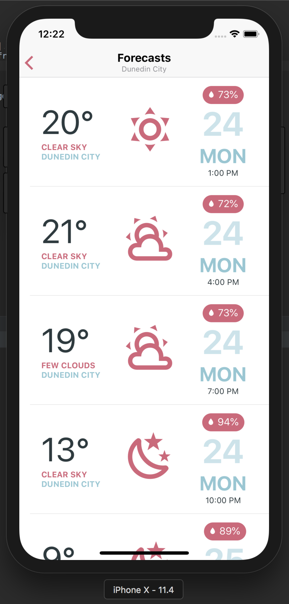

[](https://travis-ci.com/alwex/yawa)
[](https://coveralls.io/github/alwex/yawa?branch=master)

# YAWA



## Technology stack

- react-native
- redux
- redux-saga
- native-base

## External services

- openweathermap https://openweathermap.org
- geocoder https://geocoder.tilehosting.com

## Development

```bash
yarn install
react-native run-ios
react-native run-android
```

## Running tests

```bash

```

## Relese builds

```bash
react-native run-android --variant=release
```

> IOS release build require a provisioning profile and an apple developer account
